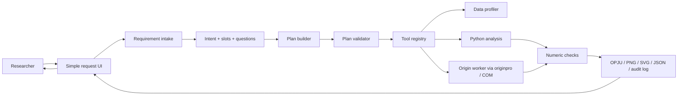

# 技术路线

## 一句话架构

用户用自然语言表达画图/分析需求，前端把需求收束成少量可编辑槽位，后端把槽位转成受控执行计划，再由 Python/Origin worker 生成图、项目文件和可复查记录。



## 产品核心变化

这个项目不是给 Origin 再做一层复杂菜单，而是把 Origin 的复杂操作藏进“需求收束器”里。

用户不需要知道 Origin 的菜单、模板、坐标轴设置、图层设置、拟合对话框在哪里。用户只需要说：

- “把这个数据画成散点图，加线性拟合，导出 PNG。”
- “横轴用时间，纵轴用电压，点改成蓝色，图例放右上角。”
- “这张图不够像论文图，把字体统一、线条加粗、导出 SVG。”

系统要做的不是立刻盲跑，而是把需求翻译成：

- Intent: 创建图、修改图、分析、导出。
- Data mapping: X/Y/分组/误差列。
- Analysis: 拟合、平滑、归一化、峰分析、统计检验。
- Style: 图类型、颜色、线宽、点型、字体、期刊模板。
- Output: PNG/SVG/PDF/OPJU。
- Clarification: 只追问阻塞执行的问题。

## 前端路线

前端要足够“薄”，但不能只是一个聊天框。推荐第一版是三块区域：

1. 顶部命令栏
   用户输入一句话需求。支持拖入数据后直接说“画图”“改图”“导出”。

2. 中间预览区
   显示数据概况、图预览、Origin 导出的图。用户每次修改都能看到 diff 或新版预览。

3. 右侧理解卡片
   用可编辑槽位展示“AI 理解为”：图类型、X/Y 列、拟合方法、颜色、输出格式。不要堆 Origin 式属性面板，只展示当前任务最相关的 5-8 个控件。

交互原则：

- 默认不让用户填表。先理解一句话，再只追问缺失字段。
- 追问必须是选择题或短输入，例如“横轴选哪一列？”而不是开放式长问卷。
- 每次执行前显示可读计划：“将使用 time_s 作为横轴，signal_v 作为纵轴，创建散点图并添加线性拟合。”
- 修改已有图时用“变更计划”，例如“只改颜色和线宽，不重新分析数据。”
- 高级设置折叠，不把初学者拖回 Origin 的复杂度里。

## 后端路线

后端拆成七个稳定模块：

1. Requirement Intake
   输入自然语言、当前数据 profile、已有图状态，输出 `RequirementIntent`。

2. Slot Filler
   从数据列、历史上下文、用户偏好、期刊模板里补默认值。默认值要写进 assumptions。

3. Clarifier
   只生成阻塞性问题。非阻塞字段用默认值先跑，并允许用户之后改。

4. Plan Builder
   把 intent 和 slots 变成 `ExecutablePlan`：工具、参数、顺序、预期产物。

5. Plan Validator
   检查列是否存在、参数是否合理、工具是否白名单、是否会覆盖文件、是否需要用户确认。

6. Tool Executor
   调 Python 分析、Origin project/graph/template 操作、导出文件。

7. Evaluation and Audit
   保存需求、计划、工具调用、输出、检查结果。后续用这些失败样本训练和评价 AI。

## AI 接入方式

第一阶段用规则 parser 固定 schema 和产品行为。现在代码里已有 `infer_requirement()`，可以把中文需求转成结构化 intent。

第二阶段接 LLM structured output。模型只负责填 schema，不直接操作 Origin：

```json
{
  "kind": "create_plot",
  "plot_kind": "scatter",
  "x_column": "time_s",
  "y_column": "signal_v",
  "analysis": ["linear_fit"],
  "style": {"color": "blue"},
  "output_formats": ["png", "opju"],
  "questions": []
}
```

第三阶段引入 trace/evals。每次用户说“不是我要的效果”，都要变成失败样本：原需求、AI 理解、计划、输出图、用户修正。

## Origin 执行路线

优先级如下：

1. `originpro` 高层 API：导入数据、建 worksheet、建 graph、导出图。
2. Origin Analysis Template：固定实验室/论文风格的重复任务。
3. LabTalk/X-Function：高层 API 不覆盖的 Origin 内置操作。
4. COM 低层能力：处理项目、图层、对象级操作。
5. GUI 自动化：只作为最后 fallback，不进入 MVP 主路径。

2026-05-25 本机烟测已经通过：`scripts/origin_smoke_test.py` 成功启动 Origin，导入 `examples/sample_xy.csv`，生成 `.opju` 和 PNG。

## MVP 验收标准

- 用户能用一句话提出画图需求。
- 系统能展示“AI 理解为”的结构化槽位。
- 系统只追问阻塞问题。
- 无 Origin 时能输出 plan、plot spec、数值结果和检查项。
- 有 Origin 时能生成 OPJU 和图片。
- 用户能继续说“把点改成红色”“加线性拟合”“导出 SVG”，后端能形成变更计划。
