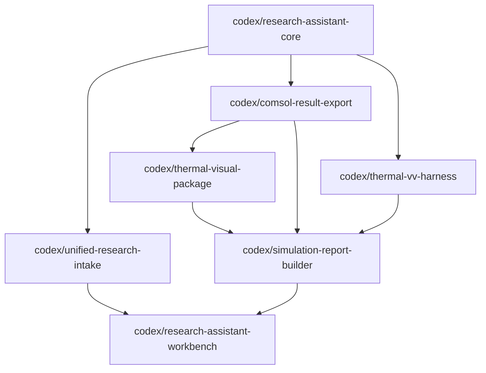

# Branch Task Cards

## Shared Product Contract

Every branch should preserve this user experience:

```text
one assistant input
-> thick context
-> thin work order
-> internal tool routing
-> useful research output
```

The user should never need to know whether a result came from COMSOL, Origin, Python, a
validation harness, or a report generator unless they inspect the evidence package.

## Branch Dependency Map



## Task Card Format

Each branch should finish with:

- Changed files
- Tests run
- New commands or APIs
- Known gaps
- Merge dependencies

## 0. Core

Branch: `codex/research-assistant-core`

Do:

- Normalize docs and README links.
- Keep test suite green.
- Document current commands.
- Avoid new product scope.

Do not:

- Build UI.
- Add COMSOL export complexity.
- Redesign contracts unless obviously broken.

## 1. Intake

Branch: `codex/unified-research-intake`

Do:

- Extend `ResearchWorkOrder`.
- Add `EvidenceTrace`.
- Improve question ranking.
- Add case-derived examples.

Do not:

- Create a separate thermal-only UI.
- Turn intake into a long static form.

## 2. COMSOL Export

Branch: `codex/comsol-result-export`

Do:

- Export result artifacts from COMSOL.
- Record command/log/model output in manifest.
- Keep mock/dry-run paths working.

Do not:

- Execute arbitrary generated COMSOL code.
- Require COMSOL for unit tests.

## 3. Visualization

Branch: `codex/thermal-visual-package`

Do:

- Define visualization manifest/spec.
- Add figure/animation quality checks.
- Integrate with exported artifacts.

Do not:

- Force Origin to do 3D field rendering.
- Treat images as conclusions without numeric checks.

## 4. Reports

Branch: `codex/simulation-report-builder`

Do:

- Generate Markdown/HTML report.
- Show missing evidence explicitly.
- Link every figure/table/log/model artifact.

Do not:

- Claim validation if checks are missing.
- Hide assumptions.

## 5. V&V

Branch: `codex/thermal-vv-harness`

Do:

- Add credibility card.
- Parse solver logs.
- Define golden case comparators.
- Add boundary/energy/mesh convergence structures.

Do not:

- Block quick-screening use cases with publication-grade requirements.
- Make V&V a separate user-facing entrance.

## 6. Workbench

Branch: `codex/research-assistant-workbench`

Do:

- Build one-entry UI.
- Show "AI understood this as..." card.
- Use tabs only for result organization.

Do not:

- Add mode buttons like "COMSOL mode" or "Origin mode".
- Overwhelm users with full expert forms.

